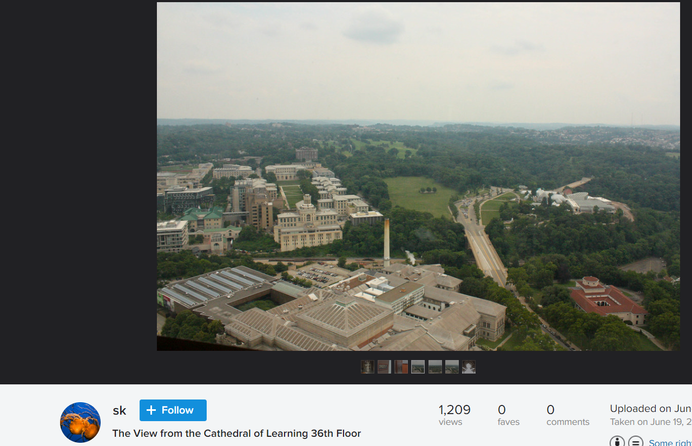
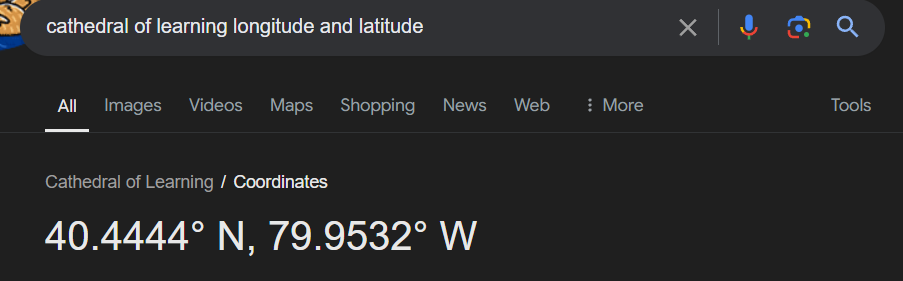

# Problem

## Description
This is an OSINT challenge.

i'm a dog mom i 🩷 dogs

Find where this picture was taken; submit your flag as ictf, both rounded to three decimal places. (example: ictf{-12.345_66.533})

## Attachments
https://cybersharing.net/s/4f1dbcbb01b5f98d

# Solution

Firstly, I tried steganography tools to find hidden metadata, but it seems like nothing is any useful. Then, I tried to search it in google images to see any relevan picture that can help in finding the location, and to my surprise, I find this

We could see from the description of the image that is is the 36th floor of Cathedral of Learning. By finding the exact location on google, we get this

