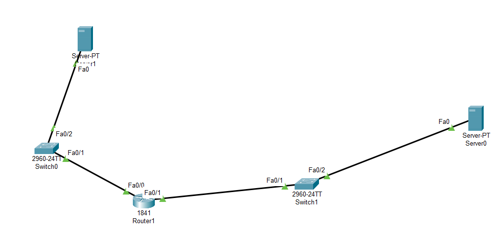

# Problem

## Description

Can you dig a bit deeper? (same attachment as packed)

There are some fake flags; this is unintentional. The real flag is not in plaintext.

md5(flag) = 17ef83e05f7f5410443994ac434b5823

## Attachments

https://cybersharing.net/s/266989fb9d6c56b1

# Solution

First of all, we need to have `Cisco Packet Tracer` installed to solve this challenge. After downloading the attachments and running Cisco Packet Tracer, we should get something like this.



Now lets take a look at the configuration of the Router. We can use command `sh run` in Privilege Exec mode to show all the running configuration that have been done on that Router. We should get something like this

```
Router>en
Router#sh run
Building configuration...

Current configuration : 837 bytes
!
version 12.4
no service timestamps log datetime msec
no service timestamps debug datetime msec
service password-encryption
!
hostname Router
!
!
!
!
!
!
!
!
ip cef
no ipv6 cef
!
!
!
!
!
!
!
!
!
!
!
!
spanning-tree mode pvst
!
!
!
!
!
!
interface FastEthernet0/0
 ip address 192.168.0.1 255.255.255.0
 duplex auto
 speed auto
!
interface FastEthernet0/1
 ip address 192.168.1.1 255.255.255.0
 duplex auto
 speed auto
!
interface Serial0/0/0
 no ip address
 clock rate 2000000
!
interface Serial0/0/1
 no ip address
 clock rate 2000000
 shutdown
!
interface Vlan1
 no ip address
!
ip classless
!
ip flow-export version 9
!
!
!
!
!
!
!
!
line con 0
!
line aux 0
!
line vty 0 4
 password 7 020F074F0D1D0728484A0C173A191D1F330C2B382C2D3728
 login
line vty 5 15
 password 7 020F074F0D1D0728484A0C173A191D1F330C2B382C2D3728
 login
!
!
!
end

```

The password seems interesting, lets try to decrypt it. I use this website `https://www.firewall.cx/cisco/cisco-routers/cisco-type7-password-crack.html` to help me decrypt it and the result have given me the flag as below

```
ictf{hidden_not_hashed}
```


